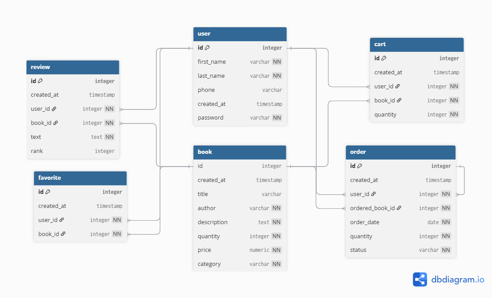

# BOOKSTORE-SERVER

 
 

## ERD

 
 

## Swagger UI, Postman API
- [Explore Swagger UI](https://app.swaggerhub.com/apis/qucompany/init/1.0.0)
- [Explore Postman API](https://.postman.co/workspace/My-Workspace~cefe9a8c-a8d6-40a1-8175-ab28c5c0b186/collection/34477062-b571b746-c612-40a2-b9ed-e7be038ae2ce?action=share&creator=34477062)

 
 

## Response codes

> [!NOTE]
> Codes divide to groups by tables from DB :
>  `users` 
>  `books` 
>  `orders` 
>  `reviews`
>  `favorites`
>  `cart`
 

### Success codes

| **HTTP code** | **Success code**  | **Description**                                  |                                                          **group** |
| ------------- | ----------------- | ------------------------------------------------ | -----------------------------------------------------------------: |
| 200           | `USER_REGISTERED` | _New user successfully registered!_              |    `users` |
| 200           | `USER_LOGGED`     | _User successfully logged in/signed in!_         |    `users` |
| 200           | `BOOKS_GETTED`    | _All books were successfully got!_               |    `books` |
| 201           | `BOOK_ADDED`      | _New book successfully added!_                   |    `books` |
| 201           | `ORDER_CREATED`   | _New order was successfully created!_            |   `orders` |
| 200           | `ORDERS_FETCHED`  | _Orders of specific user successfully fetched!_  |   `orders` |
| 200           | `REVIEWS_FETCHED` | _Reviews of specific user successfully fetched!_ |  `reviews` |
| 200           | `REVIEWS_FETCHED` | _Reviews of specific book successfully fetched!_ |  `reviews` |
| 200 | `CART_BOOKS_GETTED` | _Books were fethced successfully from cart of user!_ |  `cart` |
| 201 | `BOOK_ADDED_TO_CART` | _New book was added successfully to cart of user!_ |  `cart` |
| 200 | `FAVORITES_GETTED` | _Favorite books were fethced successfully of user!_ |  `favorites` |
| 201 | `BOOK_ADDED_TO_FAVORITES` | _New book was added successfully to favorites of user!_ |  `favorites` |

 
 

### Error codes

| **HTTP code** | **Error code**         | **Description**                                                 |                                                          **group** |
| ------------- | ---------------------- | --------------------------------------------------------------- | -----------------------------------------------------------------: |
| 400           | `FIRST_NAME_REQUIRED`  | _First name field must be filled!_                              |    `users` |
| 400           | `LAST_NAME_REQUIRED`   | _Last name field must be filled!_                               |    `users` |
| 400           | `PHONE_REQUIRED`       | _Phone field must be filled!_                                   |    `users` |
| 400           | `PASSWORD_REQUIRED`    | _Password field must be filled!_                                |    `users` |
| 400           | `PASSWORD_TOO_SHORT`   | _Password must be at least 6 digits!_                           |    `users` |
| 403           | `PASSWORD_INCORRECT`   | _Password is not correct for specific user!_                    |    `users` |
| 404           | `USER_NOT_FOUND`       | _There is no user with provided id!_                            |    `users` |
| 400           | `BOOKS_ERROR`          | _Something went wrong while fetching book!_                     |    `books` |
| 400           | `TITLE_REQUIRED`       | _Title field must be filled to add new book!_                   |    `books` |
| 400           | `AUTHOR_REQUIRED`      | _Author field must be filled to add new book!_                  |    `books` |
| 400           | `DESCRIPTION_REQUIRED` | _Description field must be filled to add new book!_             |    `books` |
| 400           | `QUANTITY_REQUIRED`    | _Quantity field must be filled to add new book!_                |    `books` |
| 400           | `PRICE_REQUIRED`       | _Price field must be filled to add new book!_                   |    `books` |
| 400           | `CATEGORY_REQUIRED`    | _Category field must be filled to add new book!_                |    `books` |
| 400           | `BOOK_NOT_ADDED`       | _Something went wrong while adding new book!_                   |    `books` |
| 400           | `ORDER_ERROR`          | _Something went wrong while creating new order!_                |   `orders` |
| 400           | `USER_ID_REQUIRED`     | _User id field must be filled to create new order!_             |   `orders` |
| 400           | `BOOK_ID_REQUIRED`     | _Book id field must be filled to create new order!_             |   `orders` |
| 400           | `QUANTITY_REQUIRED`    | _Quantity field must be filled to create new order!_            |   `orders` |
| 400           | `ORDER_DATE_REQUIRED`  | _Order date field must be filled to create new order!_          |   `orders` |
| 400           | `STATUS_REQUIRED`      | _Status field must be filled to create new order!_              |   `orders` |
| 400           | `NUMBER_TYPE_REQUIRED` | _The user_id, book_id and quantity fields must be number type!_ |   `orders` |
| 400           | `STRING_TYPE_REQUIRED` | _The order_date and status fields must be string type!_         |   `orders` |
| 404           | `ORDER_NOT_FOUND`      | _There is no orders for user with specific id!_                 |   `orders` |
| 400           | `REVIEWS_ERROR`        | _Something went wrong while fetching reviews!_                  |  `reviews` |
| 404           | `REVIEWS_NOT_FOUND`    | _There is no reviews of user with specific id!_                 |  `reviews` |
| 404           | `REVIEWS_NOT_FOUND`    | _There is no reqviews of book with specific id!_                |  `reviews` |

| 400           | `USER_ID_REQUIRED`     | _User id field must be filled to add to cart!_             |  `cart`  |
| 400           | `BOOK_ID_REQUIRED`     | _Book id field must be filled to add to cart!_             |   `cart` |
| 400           | `QUANTITY_REQUIRED`    | _Quantity field must be filled to add to cart!_            |  `cart` |
| 404 | `CART_IS_EMPTY` | _Cart of specific user is empty!_ |  `cart` |
| 500 | `CART_ERROR` | _Something went wrong while adding book to cart!_ |  `cart` |

| 400           | `USER_ID_REQUIRED`     | _User id field must be filled to add book to favorites!_             |  `favorites`  |
| 400           | `BOOK_ID_REQUIRED`     | _Book id field must be filled to add book to favorites!_             |   `favorites` |
| 404 | `FAVORITES_IS_EMPTY` | _Favorites of specific user is empty!_ |  `favorites` |
| 500 | `FAVORITES_ERROR` | _Something went wrong while adding book to favorites!_ |  `favorites` |